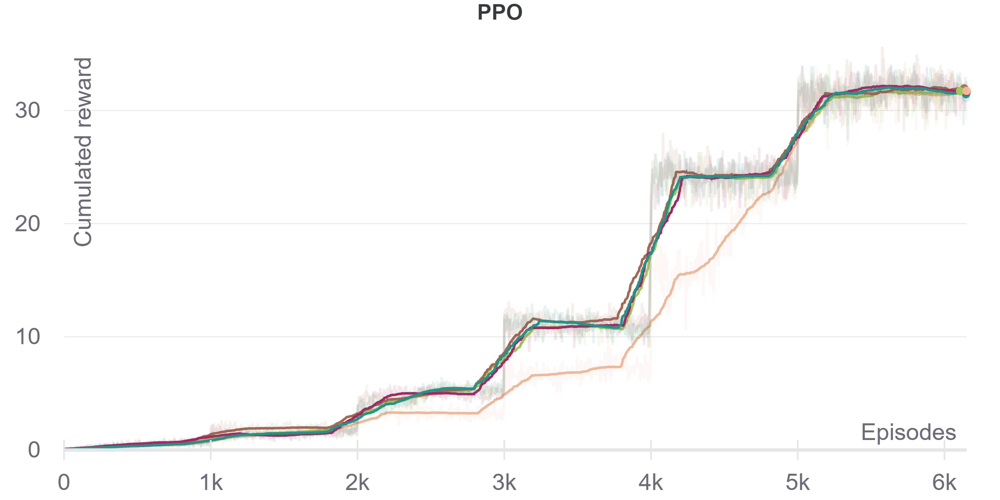
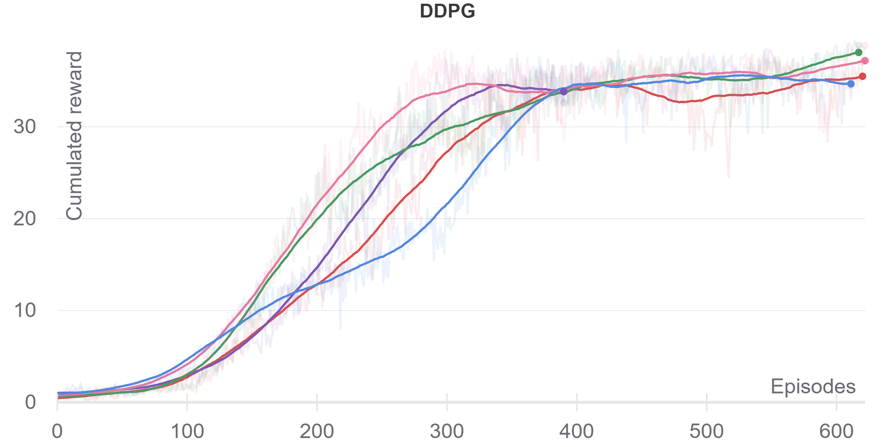
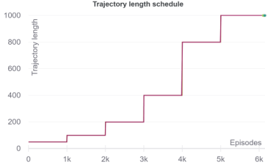

# Report

In order to solve the *Reacher (Multi agent)* environment,  a PPO [1] based as well as a DDPG [2] based agent was trained. These two algorithms were choosen because the PPO agent is trained on-policy and DDPG agent off-policy. This offers a great opportuinty to compare the two concepts. As both algorithms are based on an Actor-Critic method, we can use the actor after training to interact with the environment. Each algorithm was ran five times using the same hyperparameters, but with different seed values in order to compare their robustness. In the following figure we can see the cumulated reward evolution for each seed for each algorithm smoothed with a running average over 100 episodes.

|  |  |
| -------------------- | ---------------------- |

We cann see that both the PPO and the DDPG based agent were able to solve the environment. But where the on-policy algorithm required more than 5k episodes, the off-policy algorithm was able to do the same within ~500 episodes. From the figures we can also see that the off-policy DDPG is rather sensitive to the seed initialisation (high bias) where as with on-policy PPO this seems rather robust (low bias). For further details see the dedicated sections below

### PPO: Proximal policy optimization agent

Using the PPO algorithm proposed by [1] the agent reached an average reward of 30 after 5100 episodes. The reward continued to increase until it converged at a value of ~32. In order to improve the runtime of the learning algorithm a stepwise increase in the maximum length of the sampled trajectories was used.

In the figure above we can see the stepwise structure of the trajectory length schedule. This structure can also be observed in the cummulated reward evolution of the PPO agent.

The following hyperparameters were used to train this agent:

| Hyperparameter                    | Value            |
| --------------------------------- | ---------------- |
| Update epochs ($K$)               | $4$              |
| critic loss coefficient ($c_1$)   | $.01$            |
| $\beta$ Initial value ($c_2$)     | $.1$             |
| $\beta$ decay (multiplicative)    | $.99995$         |
| $\epsilon$ Initial value          | $.1$             |
| $\epsilon$ decay (multiplicative) | $.99995$         |
| $\lambda_{\text{GAE}}$            | $.9$             |
| $\gamma$                          | $.99$            |
| $\alpha$ learning rate            | $5\cdot 10^{-4}$​ |
| Optimizer                         | Adam             |

#### Network architectures

| Network | Configuration                                                |
| ------- | :----------------------------------------------------------- |
| Actor   | MLP ([33, 128, 64, 4]) Activation function hidden layer: *ReLU* Activation function last layer: *Linear* The outputs are interpreted as $\mu$ of a multivariate normal distribution with a diagonal covariance matrix. The variance of each action dimension is parametrized and learned during training. |
| Critic  | MLP ([33, 128, 64, 1]) Activation function hidden layer: *ReLU* Activation function last layer: *Linear* |

### DDPG: Deep deterministic policy gradients agent

Using the DDPG algorithm proposed by [2] the agent reached an average reward of 30 after 250 episodes already! The reward increased even further to a value of ~36 were the training was stopped due to time constraints.

The following hyperparameters were used to train this agent:

| Hyperparameter                            | Value     |
| ----------------------------------------- | --------- |
| Replay buffer size                        | $10^6$    |
| Batch size                                | $64$      |
| $\tau$ (soft update)                      | $10^{-3}$ |
| Timestep update interval                  | $20$      |
| $\epsilon$ Initial value                  | $1$       |
| $\epsilon$ decay (multiplicative)         | $.99995$  |
| Nr. of mini batch updates per update step | $10$      |
| Batch size                                | $64$      |
| $\gamma$                                  | $.99$     |
| $\alpha$ learning rate                    | $10^{-4}$ |
| Optimizer                                 | Adam      |

#### Network architectures

| Network | Configuration                                                |
| ------- | :----------------------------------------------------------- |
| Actor   | MLP ([33, 128, 64, 1]) Activation function hidden layer: *ReLU* Activation function last layer: *TanH* The outputs are interpreted as (argmax) actions. |
| Critic  | MLP ([33 + 4, 128, 64, 1]) Activation function hidden layer: *ReLU* Activation function last layer: *Linear* |

## Further work

In this project two reinforcement learning algorithms (DDPG & PPO) for a problem with a continuous action space were implemented and experimented with. Apart from the documented parameters only little hyperparameter exploration was done because most of the time was lost in implementing and testing the algorithms. An extensive hyperparameter grid search could yield a more robust learning process as well as some interessting insights about the task at hand. For example tweaking the parameters $\gamma$ and  $\lambda_{\text{GAE}}$ (for PPO) could be very sensible they say something about how important it is for the agent to plan into the future.

In the *Reacher* environment we could observe the expected difference between on- and off-policy learning. The next step would be to implement and compare these two approaches to a hybrid algorithm which incorporates both methods [3]. Looking at the performance of the algorithms in the *Reacher* environment it would be very intriguing to apply them to another, harder task such as the *Walker* environment and compare their performances yet again.

### References

[1] https://arxiv.org/abs/1707.06347

[2] https://arxiv.org/abs/1509.02971

[3] https://arxiv.org/abs/1611.02247